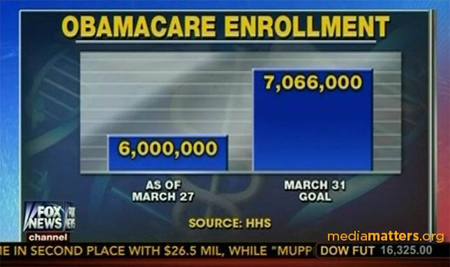
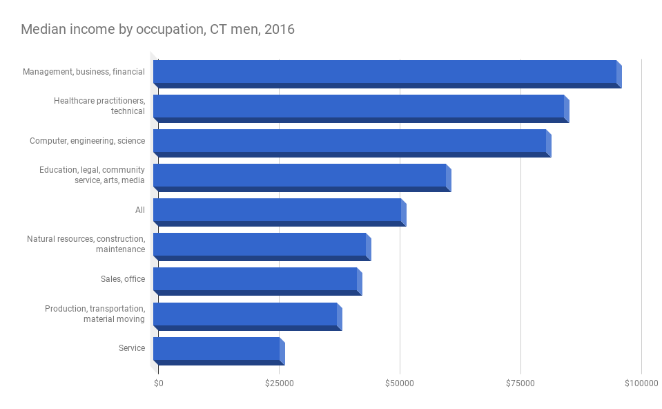

```{r setup, include=FALSE}
knitr::opts_chunk$set(
	warning = FALSE, 
	message = FALSE, 
	fig.showtext = T,
	dev = "CairoPNG",
	echo = F
	)
```

```{r}
library(tidyverse)
library(tidycensus)
library(showtext)
library(rcartocolor)
library(scales)
library(pander)
```

```{r}
acs_vars <- read_csv("../reference/acs_variables.csv")
xwalk <- read_csv("../reference/ct_xwalk.csv", progress = F) %>% 
	select(trct, town = ctycsubname) %>%
	mutate(town = str_remove(town, " town.+")) %>%
	unique() %>%
	filter(!is.na(town))
```

```{r}
money_k <- function(x) paste0("$", signif(x / 1000, digits = 2), "k")
```

```{r}
font_add_google("PT Sans", "pt")
font_add_google("PT Sans Narrow", "pt_narrow")

font_add("din", regular = "PFDinTextPro-Regular.ttf", bold = "PFDinTextPro-Medium.ttf")
font_add("frutiger", regular = "FrutigerLTStd-Roman.otf", bold = "FrutigerLTStd-Bold.otf")
showtext_auto()
```

```{r}
bold <- carto_pal(n = 11, "Bold")
temps <- carto_pal(n = 7, "Temps")
tealrose <- carto_pal(n = 7, "TealRose")
```

```{r}
theme_clean <- function(base_size = 40, base_family = "din", no_x = T) {
	out <- theme_light(base_size = base_size, base_family = base_family) +
		theme(
	    plot.caption = element_text(vjust = 1, size = rel(0.7), color = "gray30", margin = margin(12, 0, 0, 0)),
	    axis.ticks = element_line(colour = "gray85"), 
	    panel.grid.major = element_line(colour = "gray85"), 
	    panel.grid.minor = element_blank(), 
	    axis.title = element_text(face = "bold", colour = "gray20"), 
	    axis.text = element_text(color = "gray20"),
	    plot.title = element_text(face = "bold", colour = "gray10"), 
	    plot.subtitle = element_text(color = "gray20"),
	    panel.background = element_rect(fill = "gray100"),
			panel.border = element_blank(),
			strip.background = element_rect(fill = "gray95"), 
			strip.text = element_text(color = "gray20"))
	if(no_x) {
		out <- out + theme(panel.grid.major.x = element_blank(), axis.ticks.x = element_blank())
	}
	return(out)
}
```

```{r}
gnh <- acsprofiles::regions$`Greater New Haven`
```


```{r}
inc_occ_ct <- c(1, 2, 4, 7, 11, 16, 19, 27, 30, 34, 38, 40, 43, 47, 52, 55, 63, 66, 70) %>%
	str_pad(side = "left", pad = "0", width = 3) %>%
	sprintf("B24012_%s", .) %>%
	get_acs(geography = "state", year = 2016, variable = .) %>%
	filter(GEOID == "09") %>%
	rename(name = NAME) %>%
	mutate(level = "ct")
inc_occ_town <- c(1, 2, 4, 7, 38, 40, 43) %>%
	str_pad(side = "left", pad = "0", width = 3) %>%
	sprintf("B24012_%s", .) %>%
	get_acs(geography = "county subdivision", year = 2016, variable = ., state = "09", county = "09") %>%
	filter(!str_detect(NAME, "not defined")) %>%
	rename(name = NAME) %>%
	mutate(name = str_remove(name, " town,.+")) %>%
	mutate(level = "town")
```

```{r}
inc_occ <- bind_rows(inc_occ_ct, inc_occ_town) %>%
	inner_join(acs_vars %>% select(-concept), by = c("variable" = "name")) %>%
	separate(label, into = c("total", "sex", "occ1", "occ2"), sep = "!!") %>%
	replace_na(list(sex = "Total", occ1 = "All")) %>%
	mutate(occupation = ifelse(is.na(occ2), occ1, occ2) %>% str_remove(" occupations") %>% str_replace_all(",* and", ",")) %>%
	select(name, level, sex, occupation, income = estimate) %>%
	mutate(sex = as.factor(sex) %>% fct_recode(Men = "Male", Women = "Female") %>% fct_relevel("Total", "Men", "Women")) %>%
	mutate(occupation = as.factor(occupation) %>% fct_relevel("All")) %>%
	mutate(name = as.factor(name) %>% fct_relevel("Connecticut"))
```

```{r}
race <- c(total = "B03002_001", white = "B03002_003", black = "B03002_004", latino = "B03002_012") %>%
	get_acs(geography = "county subdivision", year = 2016, variables = ., state = "09", county = "09") %>%
	mutate(name = str_remove(NAME, " town,.+")) %>%
	filter(name %in% gnh) %>%
	select(name, variable, estimate) %>%
	spread(key = variable, value = estimate) %>%
	mutate(other = total - black - latino - white) %>%
	select(-total) %>%
	gather(key = race, value = value, -name) %>%
	mutate(region = as.factor(name) %>% fct_collapse("Inner Ring" = c("Hamden", "East Haven", "West Haven")) %>% fct_other(keep = c("New Haven", "Inner Ring"), other_level = "Outer Ring") %>% fct_relevel("New Haven", "Inner Ring", "Outer Ring"))
```

# Goal of this workshop

.font110[Data visualization is way too big a field to cover in one morning! But these are some starting places for improving your use of data visualization.

I'm not a data viz genius, so probably any of the charts I've made here could be improved upon.]

---

# What is data visualization?

.font110[
> *The representation and presentation of data to facilitate understanding*
>
> -- Andy Kirk, "Data Visualisation: A Handbook for Data Driven Design"

> *Data graphics visually display measured quantities by means of the combined use of points, lines, a coordinate system, numbers, symbols, words, shading, and color*
>
> -- Edward Tufte, godfather of data visualization, "The Visual Display of Quantitative Information"
]

---

# Maybe you don't need a visualization


```{r 2_val_plot}
inc_2_val_plot <- inc_occ %>%
	filter(occupation == "All", name == "Connecticut", sex != "Total") %>%
	ggplot(aes(x = sex, y = income)) +
		geom_col(fill = temps[1], width = 0.7) +
		scale_y_continuous(labels = money_k, expand = c(0, 0)) +
		labs(title = "Median individual income by sex, 2016", subtitle = "Connecticut", caption = "Source: US Census Bureau, 2016 American Community Survey 5-year estimates", x = "Sex", y = "Median income") +
	theme_clean()
```

.pull-left[
```{r fig.height=6, fig.width=6}
inc_2_val_plot
```

]

.pull-right[
Chart serves *some* purpose, but you might be better off with just text:

```{r}
vals_by_sex <- inc_occ %>% filter(occupation == "All", name == "Connecticut", sex != "Total")
```


* Working men's median income is `r vals_by_sex %>% filter(sex == "Men") %>% pull(income) %>% dollar()`, compared to women's median income of `r vals_by_sex %>% filter(sex == "Women") %>% pull(income) %>% dollar()`
* On average, working men out-earn working women by `r (vals_by_sex %>% filter(sex == "Men") %>% pull(income) - vals_by_sex %>% filter(sex == "Women") %>% pull(income)) %>% dollar()` each year
* On average, women earn `r ((vals_by_sex %>% filter(sex == "Women") %>% pull(income) / vals_by_sex %>% filter(sex == "Men") %>% pull(income)) * 100) %>% round()` cents on the male dollar

]

---

# Maybe you don't need a visualization

.pull-left[
* A few overview stats---especially if comparisons wouldn't be appropriate


]

.pull-right[
* Bullet points


]

---

# Questions to ask yourself

.font120[
If you *do* need a visualization, be intentional about what you create

What's your purpose?

* Comparing two or more observations
* Comparing values changing over time
* Showing parts of a whole
* Finding relationships between values
* Placing numbers on a map
* Distributions of values
  ]
  
---
  
# Purpose

## Comparing observations

```{r}
inc_occ %>%
	arrange(income) %>%
	filter(sex == "Total", name %in% gnh | name == "Connecticut") %>%
	mutate(name = fct_reorder(name, income, last)) %>%
	ggplot(aes(x = name, y = income)) +
		geom_col(fill = temps[1], width = 0.7) +
		coord_flip() +
		scale_y_continuous(labels = money_k, expand = c(0, 0)) +
		labs(title = "Median individual income, 2016", subtitle = "Greater New Haven towns", caption = "Source: US Census Bureau, 2016 American Community Survey 5-year estimates", x = "Town", y = "Median income") +
		theme_clean(no_x = F) +
		theme(panel.grid.major.y = element_blank(), axis.ticks.y = element_blank())
```

---

# Purpose

## Parts of a whole

```{r}
race %>%
	group_by(region, race) %>%
	summarise(value = sum(value)) %>%
	mutate(race = as.factor(race) %>% fct_relabel(function(x) str_to_title(x)) %>% fct_relevel("White", "Black", "Latino", "Other")) %>%
	arrange(race) %>%
	ggplot(aes(x = fct_rev(region), y = value, fill = race)) +
		geom_col(position = "fill", width = 0.8) +
		coord_flip() +
		scale_fill_manual(values = c(bold[3], bold[2], bold[4], bold[10])) +
		scale_y_continuous(labels = percent, expand = c(0, 0)) +
		labs(title = "Population by race, 2016", subtitle = "Greater New Haven regions", caption = "Source: US Census Bureau, 2016 American Community Survey 5-year estimates", x = "Region", y = "Share of population", fill = "Race") +
		theme_clean(no_x = F) +
		theme(panel.grid.major.y = element_blank(), axis.ticks.y = element_blank())
```

---

# Questions to ask yourself

.font120[
* Who's your audience?
  + Make charts for yourself to understand your data as well
* What's the purpose?
* What do you need to communicate? What's the takeaway?
* What can you do without?
]

---

# Focusing on your audience

Example: boxplots

Statisticians: `r emo::ji("heart_eyes")`. General audience: `r emo::ji("thinking")`

```{r include=FALSE}
pov_tract <- get_acs(geography = "tract", year = 2016, variables = "C17002_008", state = "09", county = "09", summary_var = "C17002_001", geometry = T) %>%
	select(-NAME, -moe) %>%
	inner_join(acs_vars %>% select(-concept), by = c("variable" = "name")) %>%
	mutate(low_inc = summary_est - estimate) %>%
	mutate(low_inc_rate = low_inc / summary_est) %>%
	select(GEOID, total = summary_est, low_inc, low_inc_rate, geometry) %>%
	inner_join(xwalk, by = c("GEOID" = "trct")) %>%
	mutate(region = as.factor(town) %>% fct_collapse("Inner Ring" = acsprofiles::regions$`Inner Ring`, "Outer Ring" = acsprofiles::regions$`Outer Ring`) %>% fct_other(keep = c("New Haven", "Inner Ring", "Outer Ring"), other_level = "Outside GNH") %>% fct_relevel("New Haven", "Inner Ring", "Outer Ring", "Outside GNH"))
```

```{r fig.height=4}
pov_tract %>%
	ggplot(aes(x = fct_rev(region), y = low_inc_rate)) +
		geom_boxplot() +
		labs(x = "Region", y = "Low-income rate", title = "Low-income rate by census tract, 2016", subtitle = "New Haven County", caption = "Source: US Census Bureau, 2016 American Community Survey 5-year estimates") +
		scale_y_continuous(labels = percent) +
		coord_flip() +
		theme_clean(no_x = F) +
		theme(panel.grid.major.y = element_blank(), axis.ticks.y = element_blank())
```

---

# Focusing on your audience

General audiences often more concerned with averages or summary figures, not distributions.

Or pair a simple chart with more detailed text like "Low-income rates vary greatly throughout Greater New Haven's census tracts, with rates in some tracts in the single digits, while many city tracts have rates over 50%."

```{r fig.height=4}
pov_tract %>%
	group_by(region) %>%
	summarise_at(vars(total, low_inc), sum) %>%
	mutate(low_inc_rate = low_inc / total) %>%
	ggplot(aes(x = fct_rev(region), y = low_inc_rate)) +
		geom_col(fill = temps[1], width = 0.8) +
		scale_y_continuous(labels = percent) +
		coord_flip() +
		labs(x = "Region", y = "Low-income rate", title = "Low-income rate, 2016", subtitle = "New Haven County", caption = "Source: US Census Bureau, 2016 American Community Survey 5-year estimates") +
		theme_clean(no_x = F) +
		theme(panel.grid.major.y = element_blank(), axis.ticks.y = element_blank())
```

```{r include=FALSE}
pov_tract %>% filter(region != "Outside GNH") %>% arrange(low_inc_rate)
```

---

# What's the purpose?

Hard to read, and unclear what the purpose is

```{r}
inc_occ %>%
	filter(name %in% gnh, occupation == "All") %>%
	arrange(sex) %>%
	mutate(name = fct_reorder(name, income, first)) %>%
	ggplot(aes(x = name, y = income, fill = sex)) +
		geom_col(position = "dodge") +
		coord_flip() +
		scale_fill_manual(values = c("gray70", "#56A1E7", "#E76256")) +
		scale_y_continuous(labels = money_k, expand = c(0, 0)) +
		labs(title = "Median individual income, 2016", subtitle = "Greater New Haven towns", caption = "Source: US Census Bureau, 2016 American Community Survey 5-year estimates", x = "Town", y = "Median income", fill = "Sex") +
		theme_clean(no_x = F) +
		theme(panel.grid.major.y = element_blank(), axis.ticks.y = element_blank())
```

---

# What's the purpose?

Purpose: show differences in income between towns

```{r}
inc_occ %>%
	filter(name %in% gnh, sex == "Total") %>%
	arrange(sex) %>%
	mutate(name = fct_reorder(name, income, first)) %>%
	ggplot(aes(x = name, y = income)) +
		geom_col(position = "dodge", fill = "gray50", width = 0.7) +
		coord_flip() +
		# scale_fill_manual(values = c("gray70", "#56A1E7", "#E76256")) +
		scale_y_continuous(labels = money_k, expand = c(0, 0)) +
		labs(title = "Median individual income, 2016", subtitle = "Greater New Haven towns", caption = "Source: US Census Bureau, 2016 American Community Survey 5-year estimates", x = "Town", y = "Median income", fill = "Sex") +
		theme_clean(no_x = F) +
		theme(panel.grid.major.y = element_blank(), axis.ticks.y = element_blank())
```

---

# What's the purpose?

Purpose: to show income by gender in each town

```{r fig.height=6}
inc_occ %>%
	filter(name %in% gnh, sex != "Total", occupation == "All") %>%
	arrange(sex) %>%
	mutate(name = fct_reorder(name, income, first)) %>%
	ggplot(aes(x = name, y = income)) +
		geom_path(size = 2, color = "gray80") +
		geom_point(aes(color = sex), size = 4, alpha = 0.9) +
		geom_text(aes(label = sex), data = . %>% filter(name == "Woodbridge"), size = 3.5, hjust = 1, vjust = 0, nudge_y = -1800) +
		coord_flip() +
		scale_color_manual(values = c("#56A1E7", "#E76256"), guide = F) +
		scale_y_continuous(labels = money_k) +
		labs(title = "Median individual income, 2016", subtitle = "Greater New Haven towns", caption = "Source: US Census Bureau, 2016 American Community Survey 5-year estimates", x = "Town", y = "Median income", color = "Sex") +
		theme_clean(no_x = F) +
		theme(panel.grid.major.y = element_blank(), axis.ticks.y = element_blank())
```

Alternatively, could order by largest pay gap

---

# Basic guidelines

.font120[
* Figure out what you're trying to show, and why
* Use an appropriate chart/visualization type
* Map ink to values
* Get rid of junk and distractions
]

---

# Basic guidelines

```{r out.height="60%"}
knitr::include_graphics("Which-Chart-Should-I-Use.jpg")
```

Curtis Newbold, [The Visual Communication Guy](http://thevisualcommunicationguy.com/2017/06/05/which-chart-should-i-use/)

---

# Basic guidelines

More detailed guide to picking charts: http://annkemery.com/wp-content/uploads/2017/10/AnnKEmery-FSI-Visualization-Handout.pdf

---

# Bad habits

.font120[
* Muddying your data
* Telling inaccurate stories
* Visual cues that are flashy but contribute nothing/interfere with understanding (see any cable news channel)
* Unexamined use of pie chart, 3D, shadows, etc
* Encoding information that isn't actually there---e.g. do you actually need all those colors?
* Comparing things that are not actually comparable
]

---

# Bad habits

## Data mud

```{r}
inc_occ %>%
	filter(level != "ct", occupation == "All", sex != "Total") %>%
	spread(key = sex, value = income) %>%
	ggplot(aes(x = Men, y = Women)) +
		geom_smooth(method = lm, se = F, color = "slateblue", alpha = 0.7) +
		geom_point() +
		ggrepel::geom_text_repel(aes(label = name), size = 8, segment.color = "gray50") +
		coord_equal() +
		scale_y_continuous(labels = money_k) +
		scale_x_continuous(labels = money_k, breaks = seq(30000, 100000, by = 10000)) +
		labs(title = "Men's vs women's median income, 2016", subtitle = "New Haven County towns", caption = "Source: US Census Bureau, 2016 American Community Survey 5-year estimates") +
		theme_clean(no_x = F)
```

---

# Bad habits

## Fox News-ing your data



---

# Bad habits

## 3D

If you aren't solving differential equations or plotting terrain, you probably don't need 3 dimensions.

Where should you be reading values?

```{r out.height="70%"}

```


---

# Bad habits

## Pie charts

Google "pie charts are evil." There's almost always a better way.

```{r fig.height=5, fig.width=10}
race %>%
	filter(name %in% c("New Haven", "Hamden", "Milford", "East Haven", "Branford", "Guilford")) %>%
	group_by(name, race) %>%
	summarise(value = sum(value)) %>%
	mutate(share = value / sum(value)) %>%
	mutate(race = as.factor(race) %>% fct_relabel(function(x) str_to_title(x)) %>% fct_relevel("White", "Black", "Latino", "Other")) %>%
	ungroup() %>%
	arrange(race) %>%
	mutate(name = as.factor(name) %>% fct_reorder(share, first)) %>%
	mutate(race = fct_rev(race)) %>%
	ggplot(aes(x = 1, y = share, fill = race)) +
		geom_col(position = "fill") +
		coord_polar(theta = "y") +
		facet_wrap(~ name) +
		theme_clean() +
		theme(axis.text = element_blank(), axis.ticks = element_blank(), axis.line = element_blank(), panel.grid = element_blank()) +
		# scale_fill_manual(values = c(bold[3], bold[2], bold[4], bold[10])) +
		scale_fill_manual(values = c(bold[10], bold[4], bold[2], bold[3]), guide = guide_legend(reverse = T)) +
		labs(title = "Population by race, 2016", subtitle = "Select Greater New Haven towns", caption = "Source: US Census Bureau, 2016 American Community Survey 5-year estimates", fill = "Race", x = NULL, y = NULL)
	
```

---

# Bad habits

## Pie charts

Stacked bars are easier to compare between observations

```{r}
race %>%
	filter(name %in% c("New Haven", "Hamden", "Milford", "East Haven", "Branford", "Guilford")) %>%
	group_by(name, race) %>%
	summarise(value = sum(value)) %>%
	mutate(share = value / sum(value)) %>%
	mutate(race = as.factor(race) %>% fct_relabel(function(x) str_to_title(x)) %>% fct_relevel("White", "Black", "Latino", "Other")) %>%
	ungroup() %>%
	arrange(race) %>%
	mutate(name = as.factor(name) %>% fct_reorder(share, first)) %>%
	mutate(race = fct_rev(race)) %>%
	ggplot(aes(x = fct_rev(name), y = value, fill = race)) +
		geom_col(position = "fill", width = 0.8) +
		coord_flip() +
		scale_fill_manual(values = c(bold[10], bold[4], bold[2], bold[3]), guide = guide_legend(reverse = T)) +
		scale_y_continuous(labels = percent, expand = c(0, 0)) +
		labs(title = "Population by race, 2016", subtitle = "Greater New Haven regions", caption = "Source: US Census Bureau, 2016 American Community Survey 5-year estimates", x = "Region", y = "Share of population", fill = "Race") +
		theme_clean(no_x = F) +
		theme(panel.grid.major.y = element_blank(), axis.ticks.y = element_blank())
```

---

# Bad habits

## Visualizing information that isn't actually there

```{r}
inc_occ %>%
	filter(name %in% gnh, sex == "Total") %>%
	arrange(sex) %>%
	mutate(name = fct_reorder(name, income, first)) %>%
	arrange(name) %>%
	mutate(row = row_number()) %>%
	mutate(dummy = gtools::even(row)) %>%
	ggplot(aes(x = name, y = income, fill = dummy)) +
		geom_col(position = "dodge", width = 0.7) +
		coord_flip() +
		scale_fill_manual(values = c("gray70", "#56A1E7", "#E76256"), guide = F) +
		scale_y_continuous(labels = money_k, expand = c(0, 0)) +
		labs(title = "Median individual income, 2016", subtitle = "Greater New Haven towns", caption = "Source: US Census Bureau, 2016 American Community Survey 5-year estimates", x = "Town", y = "Median income") +
		theme_clean(no_x = F) +
		theme(panel.grid.major.y = element_blank(), axis.ticks.y = element_blank())
```


---

# Few notes on visual perception

.font120[
Visual perception is a huge field of psychological study. A few basic ideas:

* It might be hard to show minute differences---but it also might not be necessary
* Ink to value---e.g. scale bubbles to area, not diameter
* Colors convey meaning
  + Cultural significance, emotion, politics
  + Color scales might imply direction
]

---

# Few notes on visual perception

Can you spot difference between tract with 20% rate and 25% rate? Is it really necessary?

```{r fig.height=4, fig.width=8}
pov_tract %>%
	filter(region != "Outside GNH") %>%
	ggplot() +
		geom_sf(aes(fill = low_inc_rate), color = "gray40", size = 0.1) +
		theme_clean() +
		theme(axis.ticks = element_blank(), axis.text = element_blank()) +
		coord_sf(ndiscr = F) +
		scale_fill_carto_c(palette = "PurpOr", labels = percent) +
		labs(title = "Low-income rate by tract, 2016", subtitle = "Greater New Haven", fill = "Rate")
```

How would you compare poverty rates between non-adjacent parts of the region?

---

# Few notes on visual perception

Putting values into buckets makes it easier to spot patterns & differences---might sacrifice detail but gain clarity

```{r}
pov_tract %>%
	filter(region != "Outside GNH") %>%
	mutate(low_inc100 = round(low_inc_rate * 100)) %>%
	mutate(brk = cut(low_inc100, breaks = classInt::classIntervals(.$low_inc100, n = 5, style = "jenks")$brks, include.lowest = T)) %>%
	mutate(min = str_extract(brk, "[\\d\\.]+(?=,)") %>% as.numeric(), max = str_extract(brk, "(?<=,)[\\d\\.]+")) %>%
	mutate(label = sprintf("%s to %s", min, max) %>% paste0("%") %>% as.factor() %>% fct_reorder(min)) %>%
	arrange(label) %>%
	ggplot() +
		geom_sf(aes(fill = label), color = "gray40", size = 0.1) +
		theme_clean() +
		theme(axis.ticks = element_blank(), axis.text = element_blank()) +
		coord_sf(ndiscr = F) +
		scale_fill_carto_d(palette = "PurpOr") +
		labs(title = "Low-income rate by tract, 2016", subtitle = "Greater New Haven", fill = "Rate")
```

Now how easy is it to compare different areas?

---

# Few notes on visual perception

What do these colors signify?

```{r}
pov_tract_change <- get_acs(geography = "tract", year = 2010, variables = "C17002_008", state = "09", county = "09", summary_var = "C17002_001", geometry = T) %>%
	select(-NAME, -moe) %>%
	inner_join(acs_vars %>% select(-concept), by = c("variable" = "name")) %>%
	mutate(low_inc = summary_est - estimate) %>%
	mutate(low_inc_rate = low_inc / summary_est) %>%
	select(GEOID, total = summary_est, low_inc, low_inc_rate, geometry) %>%
	inner_join(xwalk, by = c("GEOID" = "trct")) %>%
	mutate(region = as.factor(town) %>% fct_collapse("Inner Ring" = acsprofiles::regions$`Inner Ring`, "Outer Ring" = acsprofiles::regions$`Outer Ring`) %>% fct_other(keep = c("New Haven", "Inner Ring", "Outer Ring"), other_level = "Outside GNH") %>% fct_relevel("New Haven", "Inner Ring", "Outer Ring", "Outside GNH")) %>%
	select(GEOID, rate10 = low_inc_rate, geometry, region) %>%
	inner_join(pov_tract %>% select(GEOID, rate16 = low_inc_rate), by = "GEOID") %>%
	mutate(change = rate16 - rate10) %>%
	mutate(per_change = change / rate10)
```

```{r}
pov_tract_change %>%
	filter(region != "Outside GNH") %>%
	mutate(per_change100 = round(per_change * 100)) %>%
	mutate(brk = cut(per_change100, breaks = classInt::classIntervals(.$per_change100, n = 5, style = "jenks")$brks, include.lowest = T)) %>%
	mutate(min = str_extract(brk, "-*\\d+(?=,)") %>% as.numeric(), max = str_extract(brk, "(?<=,)-*\\d+")) %>%
	mutate(label = sprintf("%s to %s", min, max) %>% paste0("%") %>% as.factor() %>% fct_reorder(min)) %>%
	arrange(label) %>%
	ggplot() +
		geom_sf(aes(fill = label), color = "gray40", size = 0.1) +
		theme_clean() +
		theme(axis.ticks = element_blank(), axis.text = element_blank()) +
		coord_sf(ndiscr = F) +
		scale_fill_carto_d(palette = "PurpOr") +
		labs(title = "Change in low-income rate by tract, 2010-2016", subtitle = "Greater New Haven", fill = "Percent change")
```

---

# Few notes on visual perception

Do these colors tell the story of *change* more accurately? What meaning do we give to these colors?

Red = positive values, but negative outcome (e.g. increase in low-income rate)

```{r}
pov_tract_change %>%
	filter(region != "Outside GNH") %>%
	mutate(per_change100 = round(per_change * 100)) %>%
	mutate(brk = cut(per_change100, breaks = classInt::classIntervals(.$per_change100, n = 5, style = "jenks")$brks, include.lowest = T)) %>%
	mutate(min = str_extract(brk, "-*\\d+(?=,)") %>% as.numeric(), max = str_extract(brk, "(?<=,)-*\\d+")) %>%
	mutate(label = sprintf("%s to %s", min, max) %>% paste0("%") %>% as.factor() %>% fct_reorder(min)) %>%
	arrange(label) %>%
	ggplot() +
		geom_sf(aes(fill = label), color = "gray40", size = 0.1) +
		theme_clean() +
		theme(axis.ticks = element_blank(), axis.text = element_blank()) +
		coord_sf(ndiscr = F) +
		scale_fill_manual(values = temps[3:7]) +
		labs(title = "Change in low-income rate by tract, 2010-2016", subtitle = "Greater New Haven", fill = "Percent change")
```

---

# Activities!

## Find what doesn't work

.font130[
In groups, visit WTF Viz [viz.wtf](http://viz.wtf/). Find your group's favorite example of what not to do, and discuss:

* What went wrong?
* What is the visualization's purpose? Or is the purpose not even clear?
* How could you achieve this purpose differently?
]

---

# Activities!

## Improve a visualization

.font130[
Use the Data Visualization checklist to rate either a chart you or a colleague has made recently, or the chart on the next slide

Checklist: [bit.ly/vizcheck](http://bit.ly/vizcheck)
]

---

# Improve this visualization

```{r eval=FALSE, include=FALSE}
inc_occ %>%
	filter(name == "Connecticut", occupation != "All") %>%
	arrange(sex) %>%
	mutate(occupation = fct_reorder(occupation, income, first)) %>%
	ggplot(aes(x = occupation, y = income)) +
		geom_path(size = 2, color = "gray80") +
		geom_point(aes(color = sex), size = 4, alpha = 0.9) +
		geom_text(aes(label = money_k(income)), size = 3.5, hjust = 1, vjust = 0, nudge_y = -1800) +
		coord_flip() +
		scale_color_manual(values = c("#56A1E7", "#E76256")) +
		scale_y_continuous(labels = money_k, breaks = seq(0, 100000, by = 10000), limits = c(0, NA)) +
		labs(title = "Income by occupation, 2016", subtitle = "Connecticut", caption = "Source: US Census Bureau, 2016 American Community Survey 5-year estimates", x = "Occupation", y = "Median income", color = "Sex") +
		theme_clean(no_x = F) +
		theme(panel.grid = element_line(color = "black", size = 1), 
					panel.grid.major = element_line(color = "gray40"), 
					panel.border = element_rect(color = "black", fill = NA), 
					text = element_text(color = "gray50"), 
					plot.title = element_text(color = "gray50", face = "plain"), 
					axis.title = element_text(color = "gray50", face = "plain"), 
					plot.subtitle = element_text(color = "gray50", face = "plain"), 
					plot.caption = element_text(color = "gray50"), 
					axis.text = element_text(color = "gray50"))
```

```{r}
cps02 <- readxl::read_excel("../financial_security/unemployment/table12full02.xlsx", skip = 3) %>%
  select(3, 4, 11) %>%
  setNames(c("state", "group", "value")) %>%
  filter(!is.na(state)) %>%
  mutate(year = "2002")

cps16 <- map_df(1:2, ~readxl::read_excel("../financial_security/unemployment/table14full16.xlsx", skip = 3, sheet = .)) %>%
  select(3, 4, 11) %>%
  setNames(c("state", "group", "value")) %>%
  filter(!is.na(state)) %>%
  mutate(year = "2016")

cps0315 <- str_pad(3:15, width = 2, side = "left", pad = "0") %>%
  map2_df(sprintf("../financial_security/unemployment/table14full%s.xlsx", .), function(yr, path) {
    readxl::read_excel(path, skip = 3) %>% mutate(year = paste0("20", yr))
  }) %>%
  select(3, 4, 11, year) %>%
  setNames(c("state", "group", "value", "year")) %>%
  filter(!is.na(state))

cps_groups <- c("Total", "White, men", "White, women", "Black, men", "Black, women", "Black or African American, men", "Black or African American, women", "Hispanic origin, men", "Hispanic origin, women", "Hispanic or Latino ethnicity, men", "Hispanic or Latino ethnicity, women")
# cps_groups <- c("Total", "White", "Black", "Black or African American", "Hispanic origin", "Hispanic or Latino ethnicity")

cps <- bind_rows(cps02, cps0315, cps16) %>%
  filter(state %in% c("Connecticut", "United States")) %>%
  mutate(value = as.numeric(value) / 100) %>%
  filter(group %in% cps_groups) %>%
  separate(group, into = c("race", "sex"), sep = ", ") %>%
  replace_na(list(sex = "Total")) %>%
  mutate(sex = str_to_title(sex)) %>%
  mutate(year = as.integer(year)) %>%
  mutate(race = as.factor(race) %>% fct_collapse(Latino = c("Hispanic origin", "Hispanic or Latino ethnicity"), Black = c("Black or African American"))) %>%
  mutate(indicator = "Unemployment") %>%
  select(name = state, year, everything())

# rm(cps_groups, cps02, cps0315, cps16)
```

```{r fig.height=6, fig.width=8}
cps %>%
	filter(name == "Connecticut", sex != "Total", race != "Total") %>%
	mutate(label = paste(race, sex)) %>%
	ggplot(aes(x = year, y = value, color = label)) +
		geom_line(size = 0.5) +
		geom_point(size = 3) +
		scale_color_carto_d(palette = "Bold") +
		scale_y_continuous(labels = percent) +
		scale_x_continuous(breaks = seq(2002, 2016, 2)) +
		theme_clean(no_x = F) +
		theme(panel.grid = element_line(color = "black", size = 1), 
					panel.grid.major = element_line(color = "gray40"), 
					panel.border = element_rect(color = "black", fill = NA), 
					text = element_text(color = "gray50"), 
					plot.title = element_text(color = "gray50", face = "plain", size = rel(1)), 
					axis.title = element_text(color = "gray50", face = "plain"), 
					plot.subtitle = element_text(color = "gray50", face = "plain"), 
					plot.caption = element_text(color = "gray50", size = rel(1)), 
					axis.text = element_text(color = "gray50")) +
		labs(x = NULL, y = "Rate", color = "Group", title = "Unemployment", caption = "Source: Current Population Survey")
```

---

## Some improvements

```{r}
cps %>%
	filter(name == "Connecticut", sex != "Women") %>%
	mutate(race = race %>% as.factor() %>% fct_recode(All = "Total")) %>%
	mutate(sex = sex %>% str_to_lower() %>% as.factor() %>% fct_recode(workers = "total")) %>%
	mutate(label = paste(race, sex)) %>%
	ggplot(aes(x = year, y = value, color = label)) +
		# geom_line(size = 1) +
		ggalt::geom_xspline(size = 1) +
		# geom_point(size = 1.5) +
		geom_text(aes(label = label), data = . %>% filter(year == 2016) %>% mutate(value = ifelse(race == "White", value - 0.01, value)) , hjust = 0, nudge_x = 0.25, size = 8) +
		geom_point(size = 2.5, data = . %>% filter(year == 2010)) +
		geom_text(aes(label = value %>% round(digits = 2) %>% percent()), data = . %>% filter(year == 2010, race != "All"), vjust = 0, hjust = 0, nudge_y = 0.005, nudge_x = 0.05, size = 8) +
		scale_color_manual(values = c("Black men" = bold[5], "Latino men" = bold[2], "White men" = bold[3], "All workers" = "gray50"), guide = F) +
		scale_y_continuous(labels = percent) +
		scale_x_continuous(breaks = seq(2002, 2016, 4), limits = c(NA, 2018)) +
		theme_clean(no_x = T) +
		# theme(panel.grid = element_line(color = "black", size = 1), 
		# 			panel.grid.major = element_line(color = "gray40"), 
		# 			panel.border = element_rect(color = "black", fill = NA), 
		# 			text = element_text(color = "gray50"), 
		# 			plot.title = element_text(color = "gray50", face = "plain", size = rel(1)), 
		# 			axis.title = element_text(color = "gray50", face = "plain"), 
		# 			plot.subtitle = element_text(color = "gray50", face = "plain"), 
		# 			plot.caption = element_text(color = "gray50", size = rel(1)), 
		# 			axis.text = element_text(color = "gray50")) +
		labs(x = NULL, y = "Rate", color = "Group", title = "Unemployment rate, 2002-2016", subtitle = "Annual averages, Connecticut men", caption = "Source: Current Population Survey")
```


---

# Resources

* [Data + Design free open source book](https://infoactive.co/data-design)
* [Storytelling with Data blog, book, and podcast](http://www.storytellingwithdata.com/) - Cole Nussbaumer Knaflic
* [Data Stories podcast](http://datastori.es/)
* [FlowingData](http://flowingdata.com/) - Nathan Yau
  + Includes tutorials!
  + [How to Spot Visualization Lies](https://flowingdata.com/2017/02/09/how-to-spot-visualization-lies/)
* [Policy Viz blog & podcast](https://policyviz.com/)
  + Includes lots of remakes of bad charts
* [Junk Charts blog](http://junkcharts.typepad.com/) - Kaiser Fung
* [Pew Research Center Fact Tank blog](http://www.pewresearch.org/fact-tank/)
* [Catherine D'Ignazio](http://www.kanarinka.com/)
  + [What would feminist data visualization look like?](https://medium.com/@kanarinka/what-would-feminist-data-visualization-look-like-aa3f8fc7f96c)

---

# Tools

* [Data Visualisation Catalogue](https://datavizcatalogue.com/index.html)
* [Data Viz Project - catalog](http://datavizproject.com/)
* [Visualising Data blog & book](http://www.visualisingdata.com/resources/) - Andy Kirk
  + Includes huge section of tools
* [Interactive Data Visualization Checklist](https://datavizchecklist.stephanieevergreen.com/rate)
  + [pdf version](http://stephanieevergreen.com/updated-data-visualization-checklist/)
* [Makeover Monday community](http://www.makeovermonday.co.uk/)
  + Mostly Tableau-focused
---

# Stuff I've made

.big[
	[DataHaven B-sides blog: ct-data-haven.github.io](https://ct-data-haven.github.io/)
]

The code that generated these slides is on GitHub: 